# Executable reference: webhook → approval → CRM/email writes

> Synthetic portfolio artifact. This is not a customer deployment and uses no customer data or production credentials.

This example demonstrates the part of business automation that is usually harder than calling an AI API: receiving an inbound request, classifying it, proposing consequential actions, requiring approval, executing writes exactly once, verifying the result, and recovering from a partial failure without duplicating side effects.

## Architecture

```mermaid
flowchart LR
    A[Inbound webhook] --> B[Validate + normalize]
    B --> C[Read existing CRM state]
    C --> D[AI classification]
    D --> E[Approval packet]
    E -->|approved| F[Create/update CRM]
    F --> G[Read-back verification]
    G --> H[Send confirmation]
    H --> I[Delivery verification]
    I --> J[Durable journal]
```



## Run it

```bash
node examples/approved-write/approved-write.test.mjs
```

The test intentionally simulates an email-verification failure after the CRM write succeeds. The recovery run:

- preserves the successful CRM write;
- does not create a duplicate CRM record;
- retries only the unfinished email step;
- verifies the final state;
- subsequent replays perform no duplicate writes.

## Why this looks like real client work

The same pattern appears in lead intake, CRM updates, scheduling, support triage, quote workflows, onboarding, and back-office automation:

1. accept structured external input;
2. validate before model use;
3. read the current system of record;
4. use AI for bounded classification/drafting;
5. present the exact intended writes;
6. require approval for consequential actions;
7. execute using stable request identity;
8. verify each side effect;
9. persist enough state to recover safely.

## Minimal client input

A real implementation typically needs only:

- representative webhook payloads;
- access to client-owned CRM/email/API accounts;
- business rules for what can be automatic vs approval-gated;
- approved customer-facing templates.

The developer can own the integration design, implementation, tests, retry/idempotency behavior, logs, documentation, and handoff.

## Production adapters

The demo uses in-memory adapters so it is safe to run anywhere. Production adapters could target HubSpot, Zoho, Salesforce, Airtable, Gmail, Outlook, Postmark, Resend, or another client-owned system. The core workflow does not depend on a specific vendor.

## Acceptance criteria demonstrated

- malformed input is rejected before writes;
- no external write occurs without explicit approval;
- existing CRM state is read before create/update;
- CRM state is re-read after the write;
- partial failure is represented as partial, not success;
- recovery never duplicates an already-successful side effect;
- replay after completion is idempotent.
